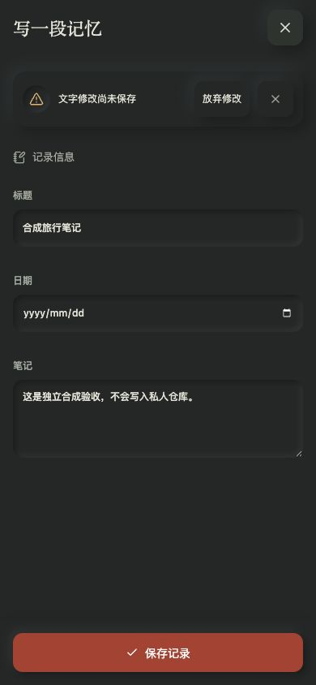
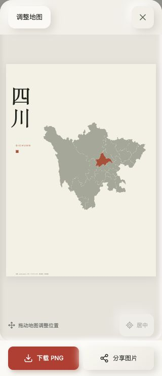
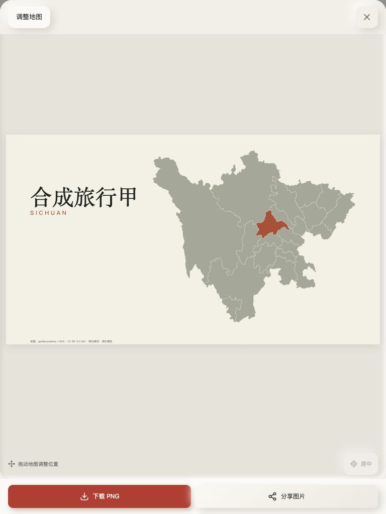
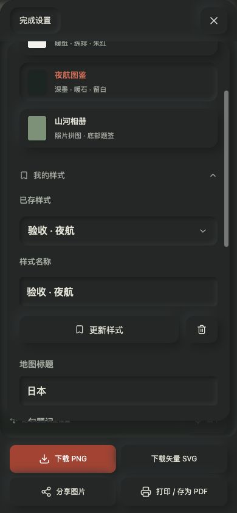

# 讨论总回顾与体验补齐 · 2026-10-04

目标：核对历次需求与开发计划，补齐能在现有授权和数据契约下完成的缺口，并重新发布。统一总清单见 [ACCEPTANCE](../../ACCEPTANCE.md)，其中区分已实现、历史验收、本轮证据与未完成依赖。

## 当轮审阅流程

1. 正式地图 → 收藏旅行地图：健康。新捕获 1280px 地图 / 导出基线，暖纸 / 深墨、地图优先和折叠操作区保持；生产有待整理照片、没有已确认足迹。本轮没有保存 / 删除 / 发布私人数据。
2. 导出 → 选择旅行记录 → 个人样式：已补齐。过去设置仅本次弹窗，无法重用，也无法指定旅行相册；新增足迹范围和“我的样式”。收藏入口继续折叠，至多6套，载入不恢复地点、标题、日期或照片 / 精确位置选择。320px 收藏按钮为 256×44，页面宽 / 滚动宽均320，无横向溢出。保存、刷新载入、更新动作状态、两套样式选择 / 移除、A4与桌面画幅验证通过。
3. 照片拼图导出 → 失败 → 重试 / 关闭拼图：已补齐。过去串行读图无超时，边界失败要求重开弹窗；现在两路并发、进度、单次 / 总预算、总量限制和就地重试。合成404失败阻止下载；点击重试再次实际请求；取消拼图恢复导出。受控失败标签的404是注入证据，非正式站请求异常。
4. 文字记录 → 修改 → 关闭 / Escape → 继续或保存：已补齐。以前关闭直接丢失文字。现在保留输入并内嵌提示；继续、放弃、成功保存关闭、失败保留字段通过合成表单验收。切换相册 / 进入照片补充 / 回收也经过同一保护；不是刷新浏览器的持久草稿。

正式复核补充：地图与日志尚在读取时禁用“收藏旅行地图”，防止过早进入空数据作品；读完且有地域轮廓后才启用。

新增组件复用 SelectField / NeoButton / NeoNotification，不增加描边式卡片或新的色系。修正收藏 summary 的 SVG 默认块级导致图标另起行；其文字、图标和展开箭头现同排。手机保持预览与设置分开、固定动作，设置区可滚动；平板横向作品预览独立适配。

## 自动与浏览器证据

- `npm test`：130项通过，包括收藏参数白名单 / 损坏存储 / 构图边界、旧相册与旅行范围、未确认 / 其他旅程排除、读图去重 / 并发 / 顺序 / 超时 / abort / 格式与总量 / 重试。
- `npm run typecheck`、`npm run build`：本机均通过；临时 `completion-qa` 合成页面在正式检查和提交前移除。
- 采用 Codex IAB / cua_repl，没有使用外部浏览器替代。URL `http://127.0.0.1:3000/completion-qa` 仅本地合成验收；生产为 `https://travel.miaowu.org/`。
- 响应式 320×740、390×844、768×1024、1280×900，亮暗主题；页面身份 / 非空 / 无框架 overlay / 新标签无 error或warn / 实际交互通过。
- A4 PNG生成显示“图片已生成”和保存链接；IAB的两次有界下载捕获均未返回文件路径。这里只确认生成与回退入口，不声称系统文件保存、原生分享或打印通过。
- 合成笔记 / 地点与公开 GeoJSON 用于本地视图；没有提交个人照片、EXIF、原图、实际GPS或令牌。正式基线与本机全部过程图仅在 `/tmp/travel-completion-audit/`。

## 合成截图

手机文字关闭保护、窄屏四川作品、平板单次旅行的桌面画幅、手机收藏样式分别对应以上步骤；这些是当轮真实浏览器截图，非概念图。

## 未完成的独立验收 / 开发

设备：iPhone Safari 动态视口 / IME / 安全区 / 双指，系统分享 / 保存文件与实体打印，真实 GR / Q3 / iPhone 原始文件。规模：真实大图库与长时间线性能、缩略图 / 分页。数据：现行完整边界 / 小岛、任意城市 / 大洲导出、道路 / 地铁。在线：Geoapify key与供应商实测。本轮没有将这些标记完成；完整优先级与用户明确取消 / 暂缓项见 ACCEPTANCE。

## 发布

首轮功能提交 `b8e984295907174ed9ea41c35a1a1a8829f4e7d7` 的两项 GitHub 检查与 Vercel Production 已通过。最终功能提交 `ad16101d8adb70593a01adf6169958a36b435db5` 补齐加载守卫，再次通过 typecheck / build；[Checks](https://github.com/oiahoon/japan-checkins/actions/runs/37144984664) 和 [Verify clone-and-deploy build](https://github.com/oiahoon/japan-checkins/actions/runs/37144984690) 均 success。Vercel Production `dpl_GcKMgNXcNeyhUZJA4sQaMMvVv63J` Ready，travel.miaowu.org 与默认域名均指向该部署。

正式页实际验证地图加载前导出禁用、地图与日志读取完成后启用；打开导出与“我的样式”正常，无已确认足迹时保留整理入口。390px 页面宽与滚动宽均390，四个导出按钮高46px，整理动作高44px，控制台无 error / warn。最终1280px截图仅本机 `/tmp/travel-completion-audit/14-production-final-collector.png`。没有调用真实保存或修改私人数据；后续文档提交不改变功能。
