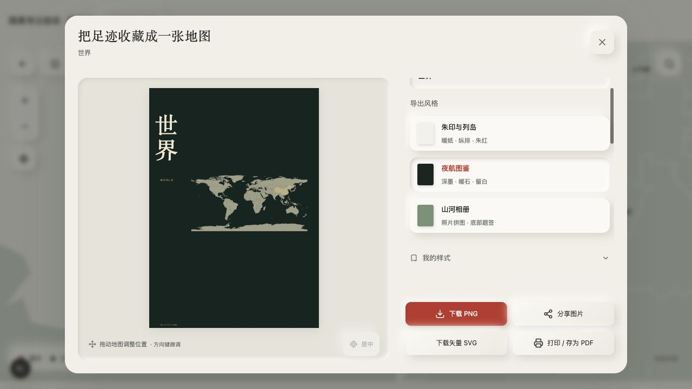
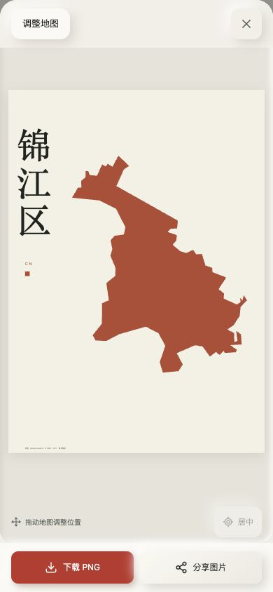

# 导出跟随探索地区 · 2026-10-04

## 行为与范围

地图导航承担范围选择；点击收藏固定当前公开地理路径，默认最后一个有可靠边界的节点。导出面板可回选世界 / 亚洲 / 国家 / 当前省市区县祖先，关闭不改变地图路径。不是当前交互地图的截屏；区域轮廓完整拟合画幅，作品内可继续独立拖拽 / 缩放。标题、题记、配色、画幅和三种风格沿用；切换范围重置年 / 相册筛选与构图，自动标题更新，手动标题保留。

选择祖先地区时恢复该地区全部有权查看的已确认到访，再应用相册 / 年份筛选，不把当前城市以外的真实足迹漏掉，也不让草稿成为到访。只嵌入这些到访关联照片；无市町村的日本照片不填县，单张 cover、不平铺；内环与边界 clip 保持。选中范围不是存储或公开权限，只改变客户端作品，未新增 API 或修改私人数据。

亚洲为视窗且独立 clip；其他国家只有已有国界。国内惰性边界传入导出，来源年份、许可保留；没有独立几何时明确回退可用父级。全国中国作品保留西沙插图；局部作品按已加载几何原坐标，历史市县分片仍有海岛覆盖缺口。日本同名村着色、计数、照片裁切按 ID 和确认坐标区分。

## 验收证据

- `npm test`：144项通过；新增范围路径、城市 / 区县、国内分片许可、缺失边界回退、照片关联隔离、同名歧义、亚洲视窗、三风格 × 三画幅、Xisha 全国 / 海南局部契约。
- 本机隔离合成页面：日本 → 福冈县 → 福冈市 → 导出，默认福冈市，SVG一个市轮廓；回选世界、夜航风格，PNG生成完成且提供文件链接。
- 世界 → 中国 → 四川 → 成都 → 锦江区 → 导出，默认锦江区、OSM / 2017署名；手机可折叠设置、选择四川祖先与相册风格。
- 全国地区搜索“福田区”加载广东分片后导出，标题 / 地区为福田区，一个区轮廓；不退回整个中国。
- 1280×720 / 1280×800、390×844、320×720：无横向溢出；320px方向键微调后横向1%，设置与预览独立，控制台无 error / warn、无框架覆盖。
- 浏览器下载事件监听未返回文件路径；产品显示“图片已生成”和直接保存链接，不能据此声称系统文件下载 / 系统分享 / 实体打印已验收。
- 本机合成路线和截图不包含私人照片、真实EXIF或凭据；临时验收路由在构建 / 发布前移除。

最终 `npm run typecheck`、`npm run build`、`git diff --check` 均通过，正式路由不含临时QA；移除临时路由后清理对应开发生成类型并重新验收。发布结果见下方。地理源年份与缺口见 GEOGRAPHY / CHINA-COVERAGE，真机 Safari / 打印与完整现行边界仍单独验收。

## 发布核对

功能提交 `8ea54aef3309edb4e2e0a2deab905603ab6375b7` 已推送 main；[Checks](https://github.com/oiahoon/japan-checkins/actions/runs/37166668833) 和 [clone-and-deploy](https://github.com/oiahoon/japan-checkins/actions/runs/37166668839) 均 success。Vercel Production `dpl_EMiWpS7Kxrw8xDY8uifJneL1zMfz` Ready，travel.miaowu.org 与默认域名均已指向该部署。最终 typecheck / build / 144项测试通过。

正式页刷新后主人会话已过期，显示登录页；未登录 `/api/checkins` 返回401，认证保护保持。未更改密码或创建会话。市县导出交互证据来自本机隔离合成验收，不能称作线上主人会话复核。真实私人照片保存 / 导出、手机 Safari / 系统分享 / 实体打印仍需部署者登录验收。后续文档提交不改变功能代码。
