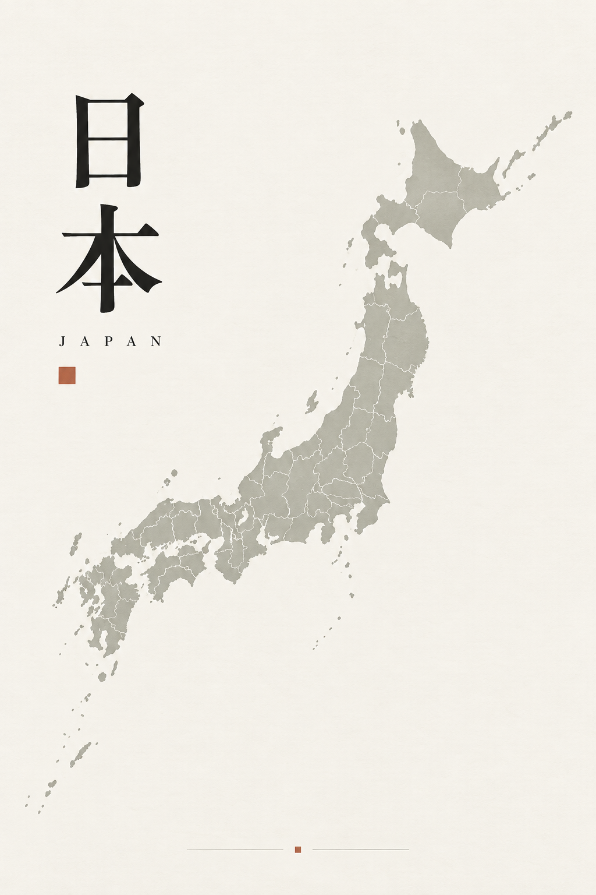
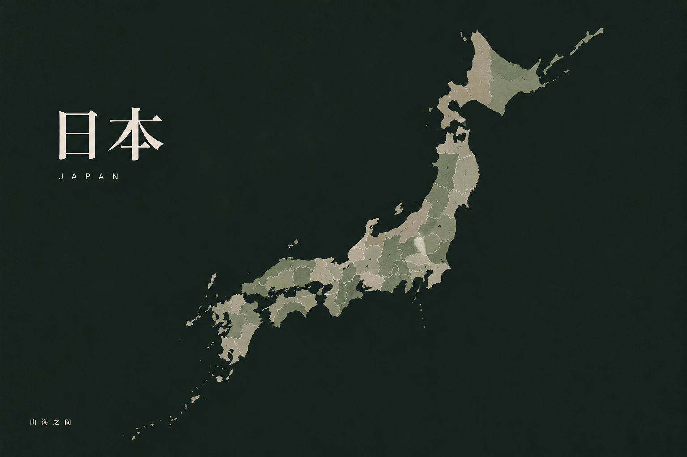
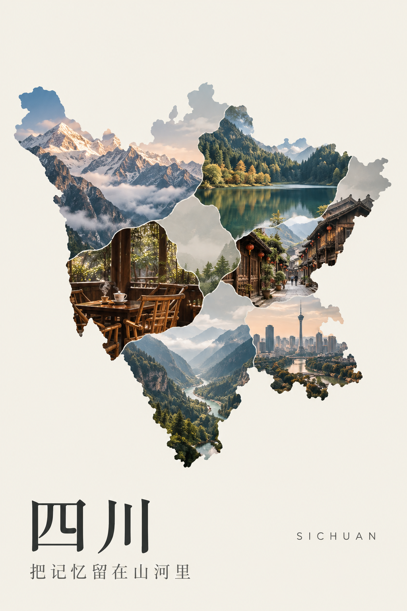

# 足迹地图导出：第二轮视觉探索

日期：2026-10-03。状态：用户已批准三种方向全部推进；已实现为三种可切换、可自定义的导出风格。

## 目标与观察

用户希望足迹地图达到愿意打印、装裱或用作壁纸的审美质量。已实际打开线上日本、四川的导出预览：地图底色过淡，题记、统计和标题分散，缩小后的画面缺少重心。现有 `旅行书页 / 夜色收藏 / 照片纪念` 共用的排版需要按地图轮廓和使用场景重做，不能只更换颜色。

## 三份概念

顺序与本轮主聊天中展示的顺序一致。由内置 ImageGen 生成，仅供视觉方向评审。所有示意照片均为生成图，没有使用私人照片、真实 EXIF 或个人旅行记录。

1. **朱印与列岛**：暖纸、纵排标题、大幅列岛轮廓、微小朱红细节。打印方向，1024 × 1536 概念稿。

   

2. **夜航图鉴**：深墨绿、暖石色地图、左侧标题与留白。桌面壁纸方向，1536 × 1024 概念稿。

   

3. **山河里的相册**：四川轮廓内的不规则照片拼接、大幅地图与底部题签。照片纪念方向，1024 × 1536 概念稿。

   

## 落地约束与下一步

- **准确地图与真实记录**：生成稿的海岸线、行政分区及照片位置不具备地理准确性，不能作为产品地图资产。落地使用现有 GeoJSON 和已确认记录；无照片地区保留底色，不能添加示例旅行史。照片只能拼入实际关联城市 / 地区，严格裁切在相应边界内。
- **按轮廓重新构图**：日本利用列岛的斜向轮廓与空白区排标题；四川采用紧凑的大幅轮廓，留出清晰题签区。两者都需分别验证打印、桌面、手机画幅，不能直接拉伸或裁切概念图。
- **内容克制**：默认以地图与简短标题为主；题记、时间、统计、地名可选择显示。来源署名仍按授权要求保留。不能在艺术化探索中取消数据来源或误标地理信息。
- **打印**：基于 SVG 的矢量地图、清晰文字和适当纸边；照片输出检查实际分辨率。按最终 A4 比例重排，而非把 2:3 概念稿作为打印定稿。
- **壁纸**：手机上方保留时钟空间，桌面留出图标区；较少文字、较强地图与背景对比。手机作品上方保留留白；当前未实现额外时钟/图标辅助安全区覆盖层。
- **交互**：保留地图大小、拖拽、居中，不恢复旋转。地图缩放与文字排版独立，PNG / SVG / 分享 / 打印一致。
- **产品界面**：应用的拟物控件沿用 UI Kit；导出作品自身使用平面地图、字体与照片构图。避免将设置界面的阴影、按钮或卡片带进海报。

三种构图已使用真实 GeoJSON 实现，默认简洁，用户可配置文字、字体、背景/地图/强调色和地图大小/位置。日本、四川与三种画幅已做几何测试，实际运行截图与浏览器检查见 [布局审阅](../layout-audit-2026-10-03.md)。生成稿不作为地理资产，实线矢量作品不复制纸张/织物纹理；没有永久模板收藏。实体打印和真实设备壁纸仍待验收。
