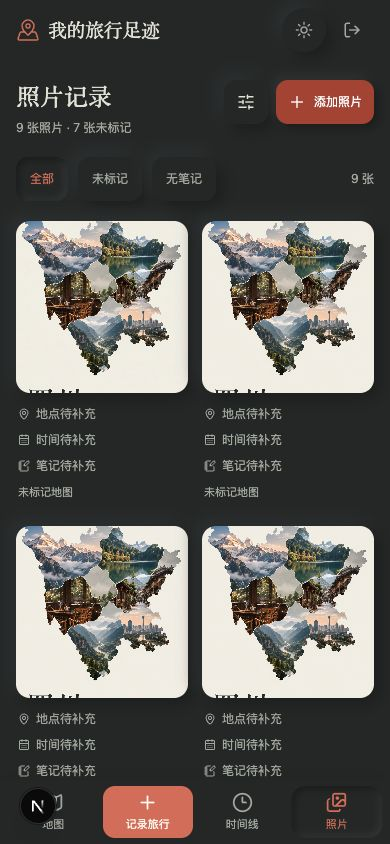
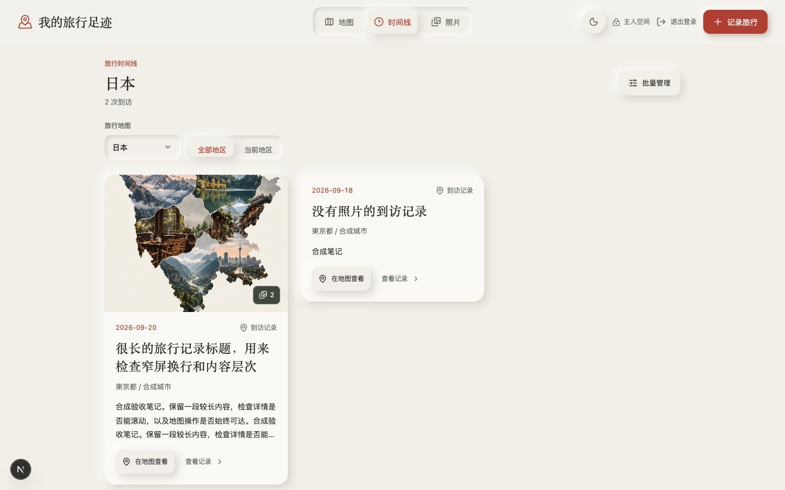
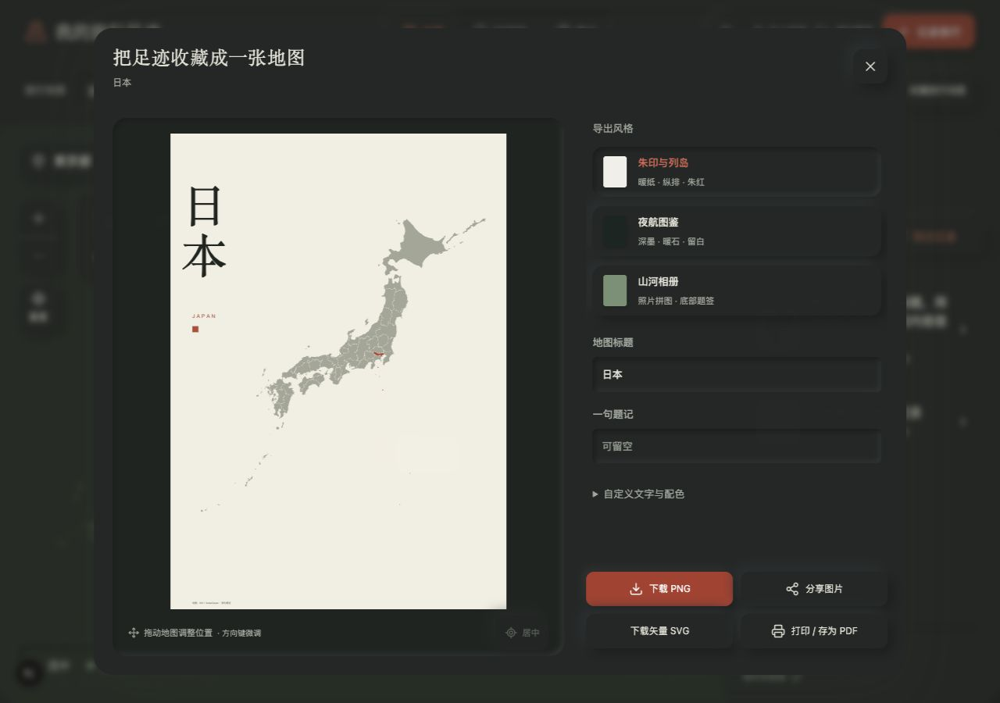
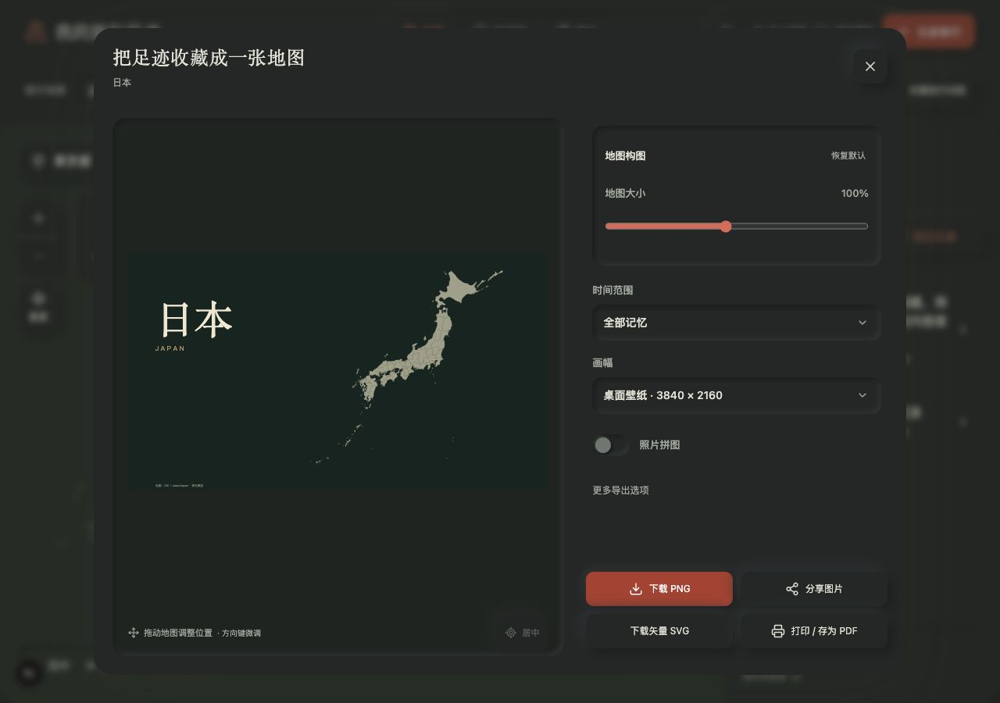
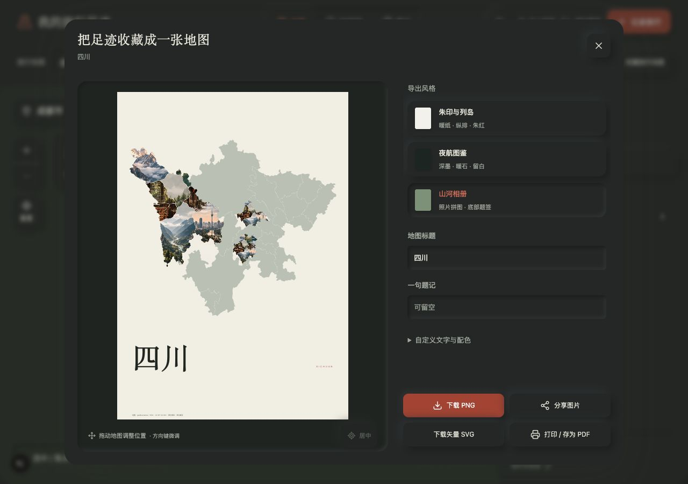
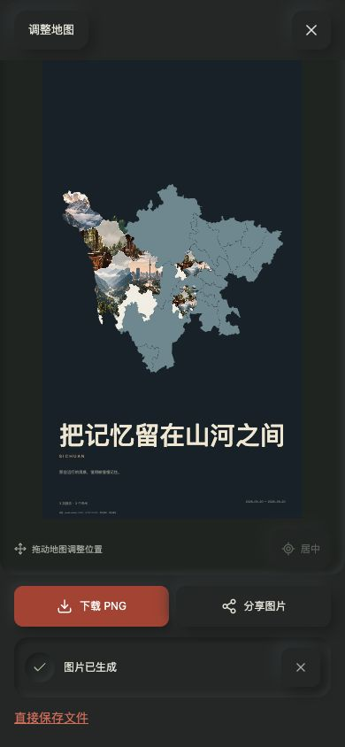

# 全站布局审阅与导出作品重构 · 2026-10-03

本轮用户批准三个海报方向全部实现，并要求允许用户自定义。延续中文、日式极简与光影构成边界的拟物控件，不更换数据模型。审阅从生产界面开始，在隔离合成日志中测试有内容、空态、长内容、只读和存储未配置状态。没有修改真实照片、记录、公开选择或认证配置。

## 流程健康度与修正

| 流程 | 审阅发现 | 已实现 |
| --- | --- | --- |
| 地图浏览 | 中等屏宽工具栏拥挤；旧 CSS 隐藏选择器；底部导航重复占位 | 地图专用工具栏，手机/平板折叠；明确布局样式归属；地图占满剩余动态视口 |
| 地图/时间线/照片切换 | 不同页面标题、间距、操作密度不一致；只读导航数量与动画位置容易错位 | 抽出 JournalHeader、JournalMobileNav、PageHeader；滑块根据实际选项数量和索引对齐 |
| 上传 | 重开弹窗把旧草稿混入新批次；空上传弹窗仍过高 | 当前批次独立展示；历史草稿留在照片库；按内容增长的底部弹窗 |
| 照片整理 | 慢速/失败图片呈空白；照片与文字对齐各自实现 | 共享 PhotoImage，稳定画幅、加载和错误状态；地点/日期/笔记摘要与缺项保留 |
| 时间线 | 长标题/长笔记打散节奏；主动作与管理动作竞争 | 统一 4:3 封面，笔记三行摘要；点击标题聚焦地图，显式查看记录入口 |
| 记录详情/查看器 | 小屏管理操作拥挤，地图动作被长内容推走 | 共用 SheetHeader；详情固定地图操作；查看器翻页和缩放分组，管理按需展开 |
| 批量管理/回收站 | 标题、关闭按钮、长条目间距不一致 | 相同弹窗头、44px 操作目标、条目换行；保留可恢复删除及确认 |
| 地图导出 | 三种旧模板布局过于相似，作品重心不足 | 三种独立构图和新配色；作品预览优先，设置折叠；自定义见下文 |

## 作品与自定义

- **朱印与列岛**：打印版纵排标题、暖纸、较清晰地图底色与小朱印；手机和桌面分别重排。
- **夜航图鉴**：深墨、暖石地图，桌面左侧文字留白；打印与手机保留独立画幅。
- **山河相册**：大幅地图与底部题签；选择时启用照片拼图，仍可手动关闭。只关联已确认记录中的照片；无照片地区保留底色。
- 用户可设置 24 字以内标题、35 字以内题记、宋体/无衬线、暖砂/雾蓝/深墨/默认配色，也可分别选背景、地图、强调色。背景改变时前景文字随亮度调整。统计、日期、地区标签和精确落点均可选。
- 地图 50–160% 缩放、拖拽、方向键/Shift 微调、居中；文字不随地图移动。不恢复旋转。A4 2480×3508、桌面 3840×2160、手机 1440×2560。
- 自定义保留在当前导出会话，重新打开回到默认；未实现永久模板收藏、任意字体上传或拖动文字。PNG/SVG/分享/打印使用相同矢量源，数据来源署名保留。

## 架构与样式归属

`app/ui/journal-layout.css` 管理页面布局、间距、共用图片/弹窗状态，`neo.css` 保留材质和主题令牌。`app/journal-navigation.tsx` 统一三视图导航；`app/ui/page-header.tsx` / `sheet-header.tsx` / `photo-image.tsx` 可复用。旧全局样式仍服务地图和历史组件，不在此次审阅中全量删除。`lib/poster-style.ts` 对颜色做严格十六进制校验；`poster-composition.ts` 管理画幅；`travel-poster.ts` 管理输出。

## 验收证据

实际浏览器检查：320×740、390×844、430×932、801×900、1100×760、1280×800/900、1440×900。亮暗主题跨布局抽查，不声称每一屏每一主题穷举。操作覆盖导航、地区下拉/Escape、记录地图聚焦、照片编辑保存摘要、筛选、弹窗、查看器缩放/分页、批量入口、上传、导出缩放/拖拽/自定义。合成编辑不勾选确认时，照片信息更新但不产生地图记录。只读两项导航与主人四项导航滑块位置实际测量一致。登录/组件实验室 320px 无横向溢出。

- `npm test`：88 项通过。包含认证/owner、元数据清理、GPS/日期异常和边界、幂等保存、软删除、照片信息持久化、拼图裁切；新增颜色注入防护、内容开关、三风格×三画幅×日本/四川实际几何有限性、平移不移动标题。
- `npm run typecheck`、`npm run build` 通过；构建路由清单不包含临时 QA。
- 本轮浏览器确认 PNG canvas 生成成功与保存回退链接。IAB 的文件下载事件未回传，未据此宣称本轮落盘尺寸验收；原有下载端到端记录见 PROGRESS 历史。实体打印、物理 iPhone/Safari、系统原生分享仍待设备检查。
- 本机临时 QA 路由、网络桩、原始照片未交付。下列截图只含生成示意图、合成记录和公开地理边界，没有真实旅行记录。它们是**运行时截图**，不是新生成的设计稿。

## 发布验收

沿用已实现的服务端密码认证、私有 GitHub 存储和 GitHub→Vercel。推送后核对源码 SHA、GitHub CI、Vercel Ready、正式域名指向与运行界面。生产验证不写入私人照片/到访；部署成功不等同真实设备或实体打印验收。
