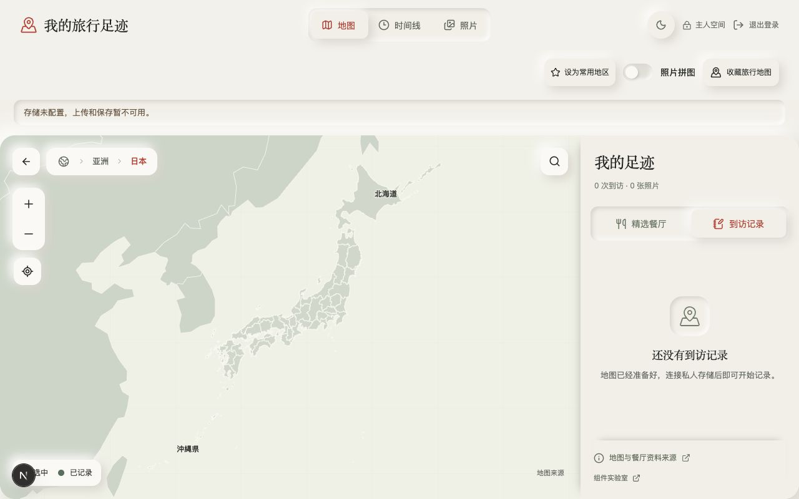
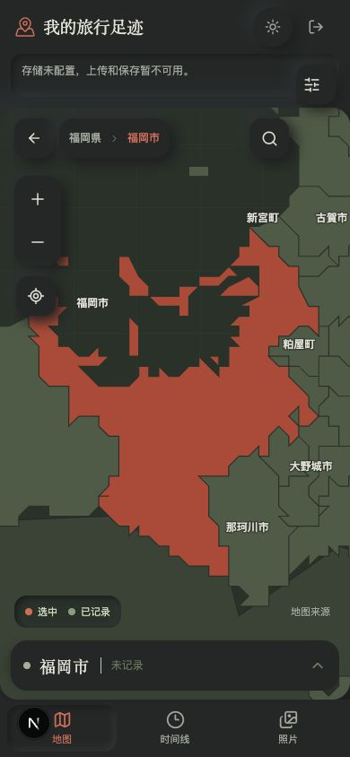

# 连续地图探索 · 2026-10-04

继续既有地图导航，不新增顶部地区选择器。地图承担空间入口，路径承担位置感和返回；搜索用于远距离跳转，居中是显式动作。沿用暖纸、深墨、朱红，控件靠光影构成边界；行政边界仍提供必要轮廓。

## 改进与取舍

- 拖入相邻地区时，依据实际中心归属更新路径，保持相机和缩放锚点。进入和退出尺度分开，海面、内环、重叠外接矩形不猜地区。
- 当前细节背后保留可进入的邻接国家、省份和市州，不必先缩到全图。视野外路径不绘制，不产生大量离屏键盘操作。
- 国内细节按省加载；到达后就地更新层级。用户已拖拽时禁止异步数据重新居中。未知轮廓仍显示父级。
- 修复成都专用区县与全国分片身份冲突，保留专用几何；日本同名町村继续使用源 ID。
- 动画结束清除旧 hover；减少动态效果设置仍关闭转场。手机操作尺寸最小 44px，路径按屏宽压缩。

## 本机浏览器验收

目标流程：地图 → 点击 / 搜索地区 → 缩放与跨边界平移 → 路径、侧栏跟随 → 缩小 / 返回。Codex in-app browser，127.0.0.1:3000，使用现有主人本地会话与未配置的存储；无真实照片或访问记录写入。

| 验收 | 结果 |
| --- | --- |
| 320 / 390 / 768 / 1280px、明暗 | 无横向溢出，地图控件触达 / 路径可用 |
| 日本 → 邻国 → 缩小亚洲 | 背景国家可进入，按钮连续换层 |
| 福冈市键盘平移 | 相机 span 保留，离开城市时更新父路径 |
| 杭州 → 西湖区 → 拖出 → 杭州 | 地图继续可拖拽 / 滚轮，区县视野不锁死 |
| 成都 → 锦江区 | 加载全国分片后仍可正确点击，专用几何与选中节点一致 |
| 边界 / 内环 / 重叠框、分片到达 | 合成测试不修改相机，不猜海面，没有边界不下钻 |
| 无框架覆盖与控制台 | 最终新会话复核；开发中的语法 / fixture 类型错误已修复 |
| 测试 / 类型 / 正式构建 | npm test（122），npm run typecheck，npm run build |

生产在 commit + push 后另核对 GitHub 两项检查、Vercel Ready 与正式域名实际交互。真机双指 / Safari、道路底图、非已有细节国家和全部现行行政几何没有在本轮验收。

截图使用公开几何、空日志；不包含私人照片、EXIF 示例或真实访问位置。

