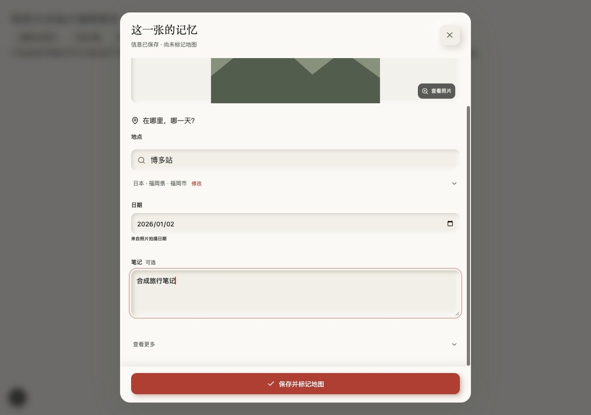
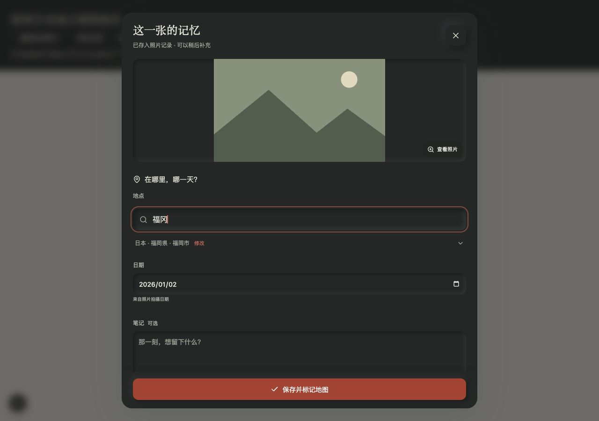
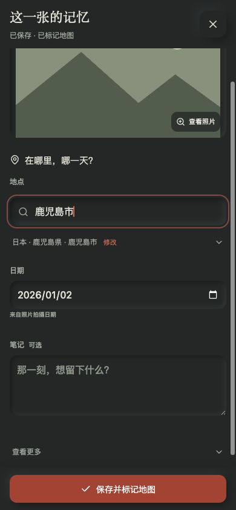
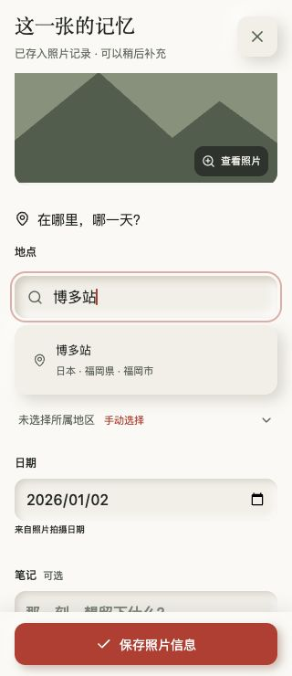
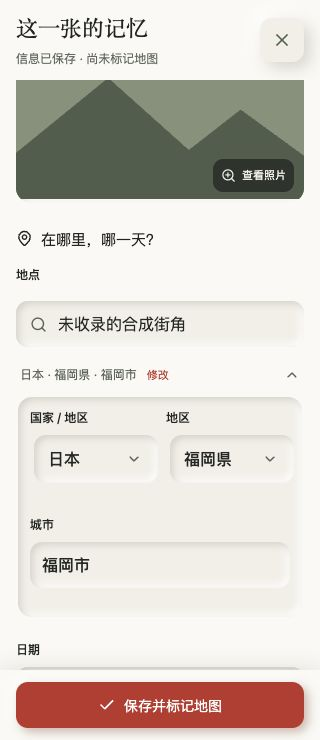
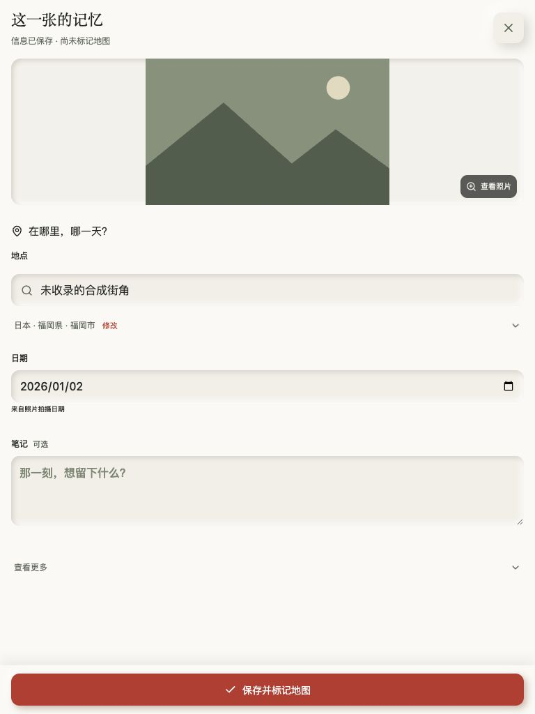
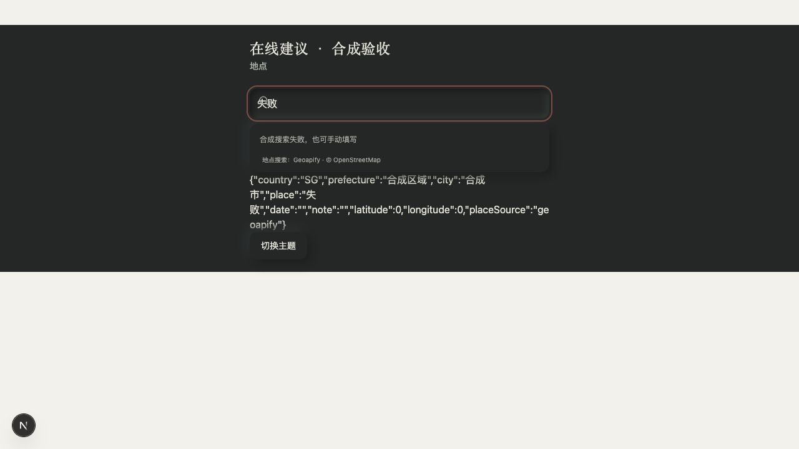

# 地点编辑与按钮确认 · 2026-10-03

## 设计

同一个地点区块包含关键词输入、可选建议、低强调所属地区摘要。摘要只在修改时展开国家 / 地区 / 城市字段，避免上下两块凹陷输入重复。输入与建议使用现有暖纸 / 深墨、凹陷 / 轻凸光影；日期与笔记维持主次，精确坐标和相机信息留在查看更多。主按钮固定在底部，手机版输入字体 16px、操作目标至少 44px；保留可见键盘焦点。顺手修正 PhotoImage 包装 span 被“查看照片”浮层样式误匹配造成的预览偏移。

取消确认 checkbox。完整信息的按钮为“保存并标记地图”，缺项为“保存照片信息”；前者直接调用原有 confirmed:true 服务端校验，后者存私人草稿。建议选择 / EXIF 展示不创建到访。已标记信息不能删空后绕过服务端重新确认。

本地建议使用行政区 / 已维护别名，非完整 POI 数据库。保留用户具体地点名称，不把“博多站”替换成“福岡市”；府中等同名地区必须选择。识别为另一地区的文本先清空原归属；所有地点编辑清除旧坐标。未知具体地点可以沿用用户已审阅父地区，仍需明确保存。

## 验收

使用临时 `/location-qa`、`/location-qa/online` 和 `/location-loading-qa`，生成纯 SVG 山形占位照片；没有加载或提交用户照片，真实仓库没有写入。临时页面 / 模拟 API 在构建与提交前删除。浏览器为 Codex IAB。

| 范围 | 结果 |
| --- | --- |
| 320 / 390px 手机、768px 平板、1280px 桌面，浅色 / 深色 | 无编辑区横向溢出，底部按钮可见；手动字段、长地名与建议布局正常 |
| 地点补齐 | 福冈 / 鹿儿岛 / 博多站主动选择后补齐国家与父地区，具体名称保留 |
| 同名 / 跨地区 | 府中展示东京 / 广岛市 / 广岛町；新地区清空旧归属直到选择 |
| 键盘 / 焦点 | Arrow / Enter 选择，Esc 只收起建议；输入法组合阶段不提交 / 发查询 |
| 无结果 | 支持直接手填与所属地区修改 |
| 索引慢加载 | 5 秒合成等待中显示加载状态；改名后暂不允许旧归属生成地图标记，索引到达后重新核对，选择后恢复保存 |
| 保存 | 缺日期草稿保持未标记；合成失败保留全部字段，重试后保存 / 重开正确 |
| 可选在线 API（仅合成） | 防抖与加载状态、关键词变化隐藏旧结果、取消旧请求、选择填入字段、错误后再搜索恢复 |
| 控制台 | 本地编辑无 error / warn；在线合成失败注入产生预期的 503 网络记录，无框架错误 |
| 自动检查 | 104 个测试覆盖 owner / 只读 / Origin、输入与响应边界、缺少 key、无效 GPS、保存确认、元数据清除、失败重试和来源保留；typecheck / build 通过后发布 |

## 独立待验收

生产只启用本地建议。在线客户端 / 服务端以合成供应商响应验证，未做真实 Geoapify 查询；官方注册入口 ERR_CONNECTION_CLOSED，未创建账号或获取 key。供应商许可 / 配置见 SELF-HOSTING.md。真实 POI 覆盖、iPhone 触屏键盘 / Safari、真实私人保存仍须独立验收，不能以本轮合成照片代替。

## 正式站点检查

主体提交 `b2394e3415949561cf86b5bd1bed5cc2931ea4a2` 已推送，Checks [37128155182](https://github.com/oiahoon/japan-checkins/actions/runs/37128155182) 与 clone/build [37128155183](https://github.com/oiahoon/japan-checkins/actions/runs/37128155183) 成功，Vercel `dpl_9Ybik6zkq2FqBnHQqe8ZK5xjYTC8` Ready，两个正式域名指向该版本。主人会话通过正式域名打开照片编辑，已保存位置 / 日期正常回填；输入本地维护的地点别名、选择建议、轻量摘要与新保存文案正常，无确认 checkbox 或横向溢出，控制台无 error / warn。只试填后关闭，未保存 / 上传 / 移除 / 恢复私人数据；没有将私人照片或真实地点日期截图提交到 Git。

仅查看 Vercel 环境变量清单，未读取凭证值；当前没有 GEOAPIFY_API_KEY，生产保持本地建议。浏览器直接导航 JSON 接口被客户端阻止，未用其他手段绕过；页面内读取和地点建议正常。线上首次索引响应较慢，后续补丁已通过合成 5 秒等待验收，保护输入后的旧地区与加载状态。补丁最终发布状态以 main 的 GitHub Checks / Vercel 当前生产检查为准。
