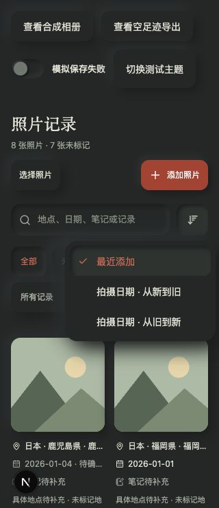
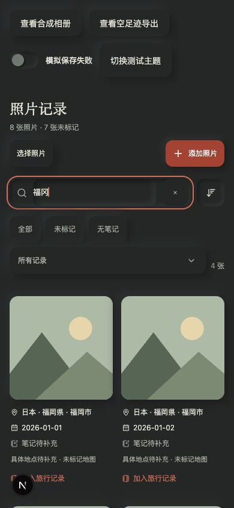
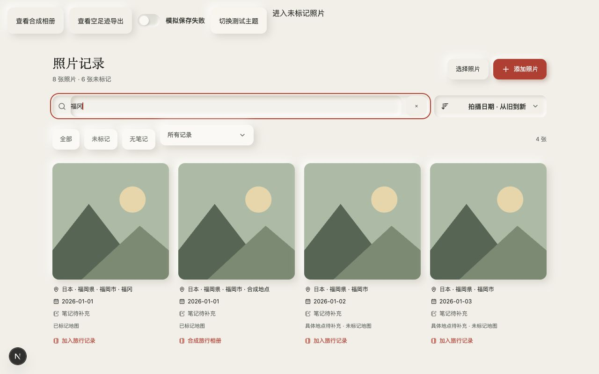
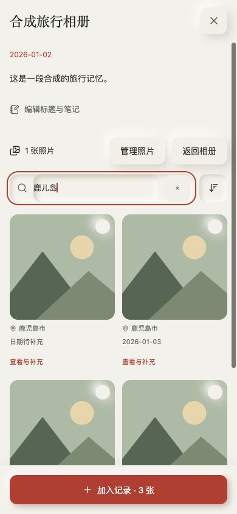

# 双角色实际试用与改进 · 2026-10-04

## 方法和证据

以现有正式域名的主人会话只读试用，先截取当前页面，再判断问题。390px 暗调：01 地图、02 照片库、03 照片编辑、04 时间线、05 新建旅行记录、06 导出。截图保存在本机 `/tmp/travel-role-audit/`，其中包含私人照片，不进入 Git。未保存、删除、公开或重新分组真实数据。相册已有成员的管理交互还需隔离合成数据验证，不能由空相册界面宣称已验收。

## 资深产品视角

做得好：地图成为地区导航，手机地图占据主区域；统一暖纸 / 深墨 / 朱红和光影控件；照片地点、日期、笔记与缺项状态可读；三类记忆在时间线有不同呈现；保存与地图确认分离，保护用户免受错误自动标记。

问题与优先级：
- P1，步骤 01–03：已保存照片仍未标记，但空地图只引导再次上传，缺少继续整理入口。将未标记数量和整理动作接入空足迹状态，保持地图控件不拥挤。
- P1，步骤 02–03：每张编辑后关闭，整理一批照片要反复找卡片。增加保留当前筛选顺序的保存下一张，失败仍留在原照片；未保存关闭需轻量保护。
- P2，步骤 02、05：只有缺项 / 记录过滤，找具体城市、日期、笔记和选图仍靠滚动。增加共用搜索及拍摄日期排序，空结果提供清除条件；选图搜索不能丢失之前选择。
- P2，现有相册组件代码审查：浏览照片默认选择移除，混淆阅读和管理意图。默认查看照片，显式进入管理模式才可选择移出。
- P2，步骤 02：小屏标题和操作挤在一行，数量断行。统一搜索区、筛选区和页面头的节奏及 44px 触达。

## 旅行爱好者视角

做得好：原图日期建议保留，笔记属于具体照片；缺少定位也能先存照片；独立照片、文字和旅行相册并存；地图可连续探索，三种海报构图有收藏感，照片拼图不越过地区边界。

问题与优先级：
- P1，步骤 01–03：回来后已有照片却没有足迹，缺少清楚的下一步。直接进入待整理照片，逐张确认，不能因批量整理把多地照片合成同一次到访。
- P2，步骤 02、05：按目的地 / 日期找照片是实际旅行整理需求，照片少时尚能翻，照片多时会放大负担。搜索覆盖已存地点、日期、笔记及相册名称；拍摄日期排序只整理呈现，不推断或改写照片信息。
- P2，步骤 06：没有已确认到访时仍能导出空地图，缺少从作品回到整理照片的捷径。提供小的状态动作，保留空白底图导出能力。

## 本轮范围

落实上述整理路径、搜索 / 排序、阅读与管理分离、空海报返回整理。保持现有地图层级、三种海报构图、EXIF 确认、私有存储 / 权限、回收和关联契约。道路 / 地铁、完整 POI、地图作品永久收藏、原生离线不属于本轮实现。

## 验收

上述范围已实现。隔离合成页面验收搜索“福冈”匹配“福岡市”、多关键词 / 空结果清除、拍摄日期排序、关闭保护、保存后下一张、失败保留原图与笔记再重试、明确保存标记、跨搜索加入 / 移出及保留选择、相册阅读打开查看器、查看器顺序、空海报返回整理。320 / 390 / 768 / 1280px、明暗均检查；320 和 768 / 1280px 未见横向溢出，编辑 / 相册动作保持视口底部。新会话控制台无 error / warn。开发过程中调整临时测试页面产生一次 Fast Refresh 全量重载；删除临时页面后留下的开发类型缓存已清理，再跑正式检查，未将测试页面或绕过认证机制发布。

`npm test`：126 / 126 通过，包含现有缺失 / 非法 GPS、边界、确认、元数据剥离、所有权与失败重试；新增搜索交集、建议日期不改写、缺日期排序、队列跳过、字段修改检查。`npm run typecheck` 与 `npm run build` 通过。正式域名部署验证将在提交后补入，合成验收不能代替实际私人 GitHub 写入、iPhone 键盘 / 双指、系统分享或实体打印。

以下截图仅包含合成插画、合成信息和临时测试控件，可进入 Git；线上私人照片截图仅本机保存。

## 后续审阅建议

私人图片读取应在真实量级下测量并考虑专门缩略图、请求预算；作品设置收藏和按旅程导出仍未实现。边界历史年份、细岛覆盖、POI / 地铁道路与实体打印质量仍不能由本次界面验收宣称解决。
